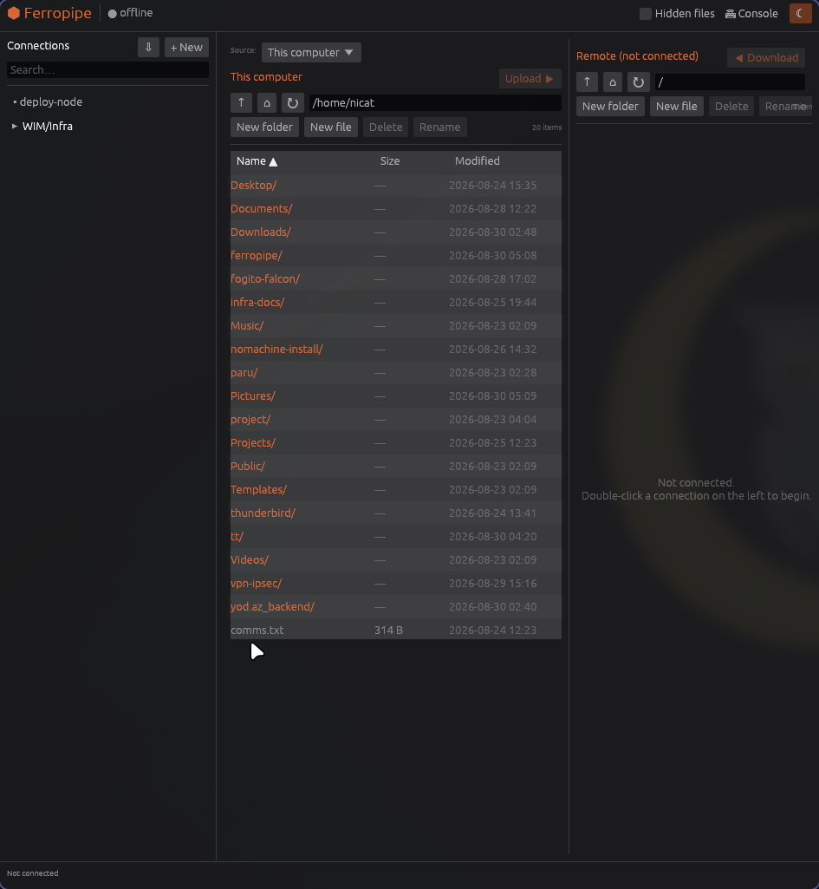

# Ferropipe

A native **Rust** connection manager and file transfer tool — SSH/SFTP, SMB, WinRM, and
RDP — with a **dual-pane file browser**, drag-and-drop transfer (including
**remote-to-remote**), an embedded command console, and live remote-file editing. Built on
[`egui`](https://github.com/emilk/egui). An XPipe/Termius-style client, in one static binary.



## Features

### Connections
- **Four connection types**, each with an encrypted-at-rest password/passphrase:
  - **SSH / SFTP** — native shell exec + file browsing (`ssh2`/libssh2).
  - **SMB / CIFS** — Windows/Samba shares, no SSH needed (`pavao`/libsmbclient). Browse
    shares from the server root, transfer files.
  - **WinRM** — Windows hosts without SSH: browse + transfer (PowerShell + `winrm-rs`
    built-in file transfer) and run commands. Strict TLS by default; per-connection
    "accept invalid cert" opt-in for self-signed :5986.
  - **RDP** — launched via **Remmina** with a tuned profile (GFX AVC444 codec + network
    autodetect for a responsive session).
- Nested **groups** (`WIM/Tovuz`, `Shusha Paid Route/27 KM`), search, add/edit/duplicate/delete.
- **Import** hosts from `~/.ssh/config`.
- Auth: password, private-key file (+ passphrase), or ssh-agent.

### Files
- **Dual-pane browser** — local ⟷ remote, resizable splitter, sortable columns,
  multi-select, breadcrumb/editable path bar, up/home/refresh, hidden-file toggle.
- **Drag-and-drop transfer** between panes, recursive directories, live progress queue,
  atomic writes (`.part` + rename), success/failure reporting.
- **Remote-to-remote transfer** — point the left pane at a *second* remote host (the
  "Source" picker) and transfer between two servers. (Bytes stage through the local machine
  — true server-to-server isn't possible over SFTP/SMB/WinRM; every client relays.)
- **File ops** on both sides — new folder, new file, rename, delete (with confirm).
- **Live remote edit** — right-click → *Edit (live)*: downloads the file, opens it in your
  editor, and auto-re-uploads every time you save.

### Console & terminal
- **Command console** (toggle in the top bar) — run commands on the SSH/WinRM host with
  streamed, colorized stdout/stderr and auto-scroll.
- **Open terminal** — right-click an SSH host → launches your terminal running `ssh`
  (**alacritty** by default; honors `$TERMINAL`, falls back to kitty/wezterm/konsole/…).

### Security
- **Encrypted vault** — AES-256-GCM, 256-bit key in a `0600` file; the `zeroize` feature
  wipes key material. Secrets never hit disk in plaintext.
- **SSH host-key verification** — TOFU against `~/.ssh/known_hosts`; refuses on mismatch.
- **WinRM** — strict TLS by default; PowerShell arguments are safely single-quote-escaped
  (reviewed for injection); temp files are private (`tempfile`, `0600`, auto-removed).

### UX
- Dark/light theme, orange accent, responsive (all I/O on background worker threads).
- Two concurrent sessions (one per pane) so nothing blocks.

## Build & run

Requires a Rust toolchain and: `libssh2`, `openssl`, `libsmbclient` (Arch: `smbclient`),
and — for RDP — `remmina` + `freerdp`.

```bash
cargo run --release
```

## Configuration

Under `~/.config/ferropipe/`:
- `connections.json` — connections + settings (secrets are encrypted blobs, `0600`).
- `vault.key` — the AES key (`0600`). **Back this up.**
- `rdp-profiles/` — generated Remmina profiles.

All options live in the GUI; you should never hand-edit these.

## Architecture

```
main.rs        → load store + vault, launch eframe
app.rs         → egui UI: sidebar, dual panes, console, dialogs, transfer queue, 2 sessions
remote/        → backend-agnostic worker
  mod.rs       → RemoteFs trait + generic transfer/walk/delete + command loop
  sftp.rs      → SSH connect + host-key verify + SFTP + exec
  smb.rs       → SMB via pavao/libsmbclient
  winrm.rs     → WinRM via winrm-rs (+ PowerShell for dir ops)
  worker.rs    → per-connection dispatch (SSH/SMB/WinRM)
rdp.rs         → Remmina profile generation + launch
external.rs    → terminal / editor launchers
sshconfig.rs   → ~/.ssh/config import
localfs.rs, model.rs, store.rs, vault.rs
```

Two worker threads (one per pane) own their `RemoteFs` backend and talk to the UI over
`mpsc` channels; the UI drains events each frame and requests repaints.

## Tests

```bash
cargo test
```

Covers vault crypto (round-trip / nonce-uniqueness / wrong-key), path helpers, and
ssh-config parsing.

## Notes & roadmap

- **Tiling WMs** (Hyprland/sway) size the window themselves; float it with
  `hyprctl keyword windowrulev2 'float,class:^(Ferropipe)$'`.
- Roadmap: streaming remote-to-remote (through memory, no temp file), SSH port-forward
  tunnels, chmod/permissions dialog, a pure-Rust SSH transport (`russh`).

## License

MIT.
